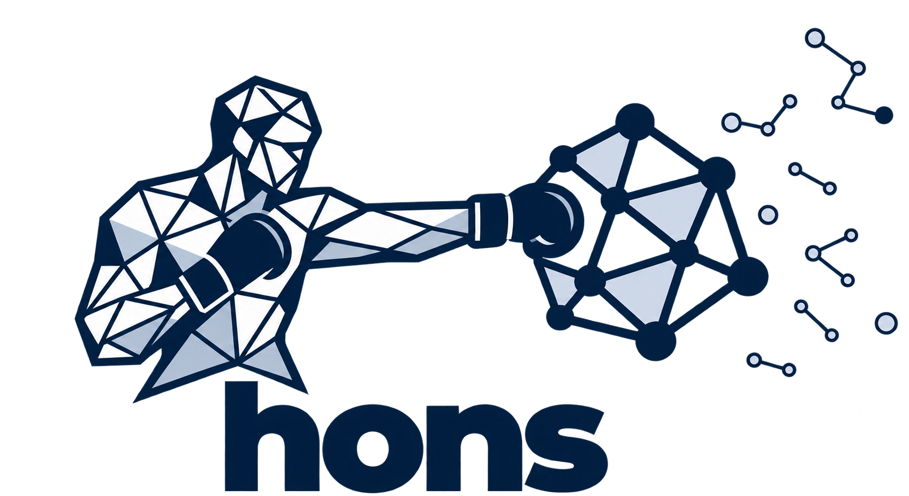
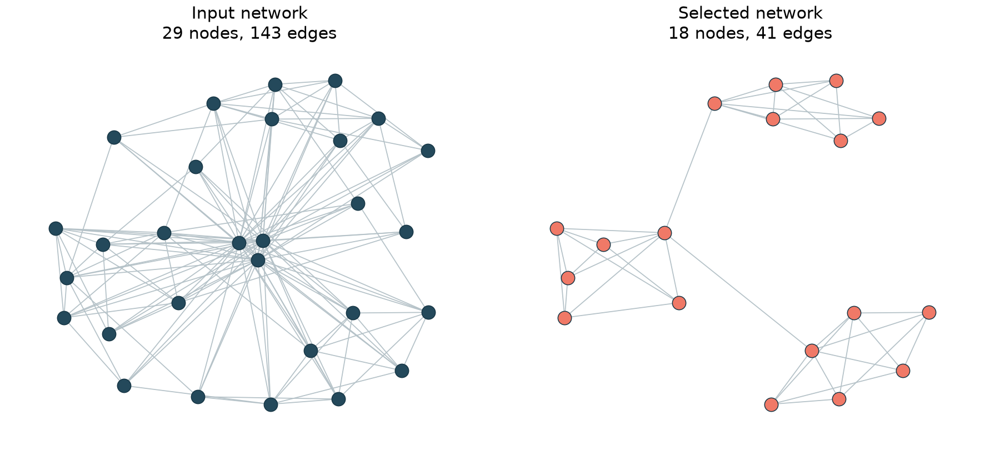

# Higher-order network selection



Network thresholding helps researchers extract interpretable structure from dense relational data by removing nodes or edges according to their properties. Choosing the cutoffs is harder: a ground-truth network is rarely available, thresholds are often selected by trial and error, and small changes can produce substantially different networks. Criteria based on individual nodes or edges can also overlook connections that contribute to higher-order structure.

**HONS selects thresholds for numerical node attributes or edge weights using the network's cycles and cavities.** These features depend on how groups of connections fit together, beyond counts of nodes, edges or triangles. HONS uses persistent homology to measure those features across a grid of candidate thresholds and selects the network whose topological representation changes least under nearby threshold changes. Minimum feature-count constraints let researchers specify how many cycles and cavities candidate networks must contain.

## Install

Use Python 3.11–3.13:

```sh
pip install hons
```

For plotting, run `pip install "hons[plot]"`.

## NetworkX example

The main demo starts with a generated NetworkX graph containing three connected structures and extra connections. Each node has an assigned numerical `weight` to threshold, and each edge has an entry value called `filtration`. In an application, you would supply a measured node or edge attribute, such as frequency or contact duration:

```python
import hons

network = hons.example_network()
selected = hons.threshold(
    network,
    node_attribute="weight",
    lower=[0, 1, 2, 3, 4],
    upper=[4, 5, 6, 7, 9],
    filtration_range=(0, 1),
    constraints=(50, 25),
)

print(network.number_of_nodes(), network.number_of_edges())    # 29 143
print(selected.number_of_nodes(), selected.number_of_edges())  # 18 41
```



Both objects are ordinary NetworkX graphs. The input remains unchanged, and the selected graph retains its node and edge attributes in their original units. Run `python examples/network_demo.py` from a source checkout to recreate the plot.

The example selects nodes with `weight` between **4 and 7**, inclusive. The selected network has five positive-lifetime H1 features and three H2 features across its filtration. H1 features describe cycles; H2 features describe cavities. `constraints=(50, 25)` requires their counts to reach at least the 50th and 25th percentiles, respectively, among selectable candidate networks.

## Choose candidate thresholds

The `lower` and `upper` arrays define the search grid in the units of the attribute you want to threshold. The numbers above are choices for this small example. Choose bounds that cover the plausible cutoffs for your network; explicit lists, `numpy.linspace` and `numpy.geomspace` are all suitable ways to construct a grid. Grid range and spacing affect which settings are compared and which setting can be selected.

Supply increasing arrays with at least two lower bounds and one upper bound. HONS evaluates every lower/upper combination. The smallest lower bound supplies a neighboring value for the score and is excluded from selection. Bounds are inclusive. A lower bound above its paired upper bound removes all nodes in node-filtering mode or all edges in edge-filtering mode.

Use `node_attribute="name"` to select an induced subgraph, or `edge_attribute="name"` to filter edges while preserving all nodes. The input must be a simple, undirected NetworkX graph. HONS returns `None` when no candidate meets both feature-count constraints.

## Specify the filtration

A filtration describes the order in which connections enter the topology calculation. Each edge needs a finite numerical entry value: a time, a distance or another quantity appropriate to your application. Smaller values enter earlier. All vertices are present at the start, and a clique enters when its last edge enters. The attribute used to remove nodes or edges and the entry values used for persistence have separate roles.

HONS accepts entry values in their original units and converts them internally to 0–1 for the persistence images. By default, the conversion uses the minimum and maximum edge values in the full input graph. Every candidate uses that same range. Set `filtration_range=(start, stop)` when you have a known observation window or want to use a fixed range across multiple input graphs. For example, use `filtration="first_seen", filtration_range=(1920, 2021)` for edges dated by first appearance. The demo explicitly uses its generating interval, `(0, 1)`.

The fixed image grid and Gaussian width apply to this normalized scale. A change of units, with the range changed accordingly, preserves the calculation. A different definition of entry order can change the result. For a strength-based filtration in which stronger edges should enter earlier, use negative strength as the entry value. A zero-width normalization range maps entry values to zero. An empty input graph defaults to a 0–1 range.

## Example application: scientific concepts

The paper applies HONS to concepts that co-occur in scientific articles. In this application, nodes represent concepts, document frequency supplies the attribute to threshold, and an edge's first co-occurrence year supplies its entry value. `examples/concept_network.py` shows how to prepare generated article–concept records as an ordinary NetworkX graph and pass that graph to HONS. This example uses a fixed observation window across candidates. The paper's empirical analysis dates each retained network from its earliest retained concept; the replication repository preserves that preparation in the saved diagrams.

| Example | Purpose | Command from a source checkout |
| --- | --- | --- |
| `network_demo.py` | Select from an existing graph and draw the before/after comparison. | `python examples/network_demo.py` |
| `concept_network.py` | Prepare article–concept records for the same general API. | `python examples/concept_network.py` |

The separate [hons-replication](https://github.com/rfunklab/hons-replication) repository reproduces calculations from the paper's saved persistence diagrams and demonstrates edge-weight thresholding on an open workplace contact network.

## Inspect the calculation

Set `return_details=True` to return `(selected, details)`. `details["grid"]` contains thresholds, network sizes, feature counts and scores; `details["filtration_range"]` records the range used for normalization. The dictionary also includes normalized persistence diagrams, image vectors and near-ties. The selected graph's `graph["hons"]` attribute records its bounds, score and feature counts.

The calculation uses H1 and H2 persistence images, a 20 × 20 sampling grid per dimension, Gaussian standard deviation 0.1, lifetime weights and coefficients in Z/11Z. Essential features are included in selection; infinite deaths become 1.00001 for imaging. Neighboring image distances are divided by their parameter separations, averaged in each direction and combined by the Euclidean norm. Dense graphs can be expensive because computing H2 requires clique expansion through tetrahedra.

For an existing grid of persistence diagrams, use `rho`, `objective` and `select` directly. Diagrams are pandas DataFrames with `dimension`, `birth` and `death` columns and must use a common normalized scale. Dictionary keys are `(upper_index, lower_index)`. The `persistence` helper accepts node identifiers and an edge-to-entry-value mapping; supply common `start` and `stop` bounds when comparing multiple networks. Exact minima follow sorted cell order, with near-ties reported within an absolute score tolerance of 1e-12.

Run the tests from a source checkout with `python -m unittest discover -s tests`.

## Paper and license

Adam Schroeder, Russell Funk, Jingyi Guan, Taylor Okonek and Lori Ziegelmeier. *Higher-Order Network Structure Inference: A Topological Approach to Network Selection*.

The MIT [license](LICENSE) applies to this repository's code, documentation and original assets. Contact Russell Funk at rfunk@umn.edu.
